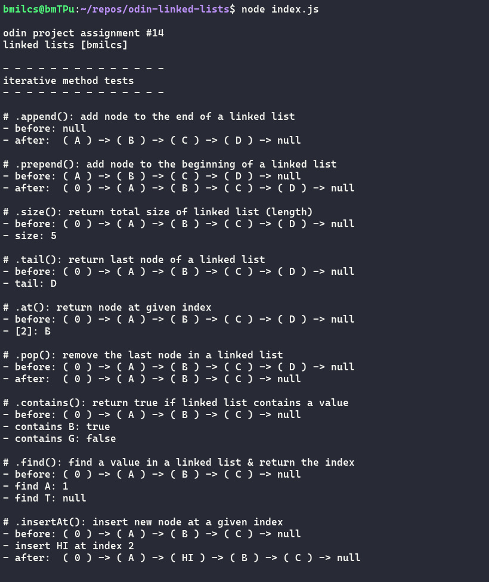
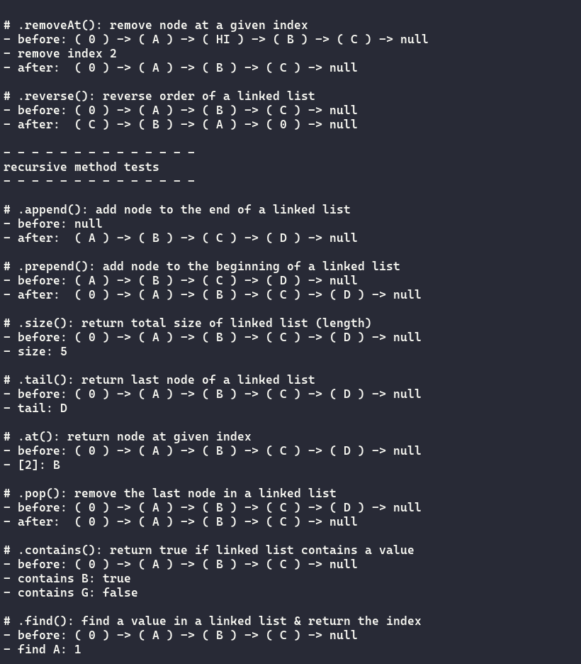

# Odin Project #14: Linked Lists

Welcome to Bryan Miller's Recursion Project, the [fourteenth assignment](https://www.theodinproject.com/lessons/javascript-linked-lists) within the Odin Project curriculum. The goal of this repo is to practice the following skill sets:

- Vanilla JavaScript
- Computer Science Data Structures
  - Linked Lists
    - `prepend()`
    - `append()`
    - `size()`
    - `head()`
    - `tail()`
    - `at()`
    - `pop()`
    - `contains()`
    - `find()`
    - `toString()`
    - `insertAt()`
    - `removeAt()`
    - `reverse()` \* for fun

## Summary

Linked Lists are one of the simplest and most fundamental data structures beyond those provided by JavaScript out of the box. Linked Lists provide a few benefits over tradition arrays:

- Do not require a sequential block of memory
- Do not require that you know the size of the list before creating it
- Manipulation & expansion is computationally efficient:
  - Instead of copying over an entire array to a new array, only a few pointers need to be changed

In addition to completing the assignment & the extra credit, I tackled reversing a linked list as well.

All in all, this was a quick and fun project to work on. It gave me an opportunity to practice recursion, which is finally starting to sink in.

## Screenshots





## Links

- [My Odin Project Progress](https://github.com/bmilcs/odin-project)

## Deployment

```sh
# clone repo
git clone https://github.com/bmilcs/odin-linked-lists

# run script (requires node)
node index.js
```
